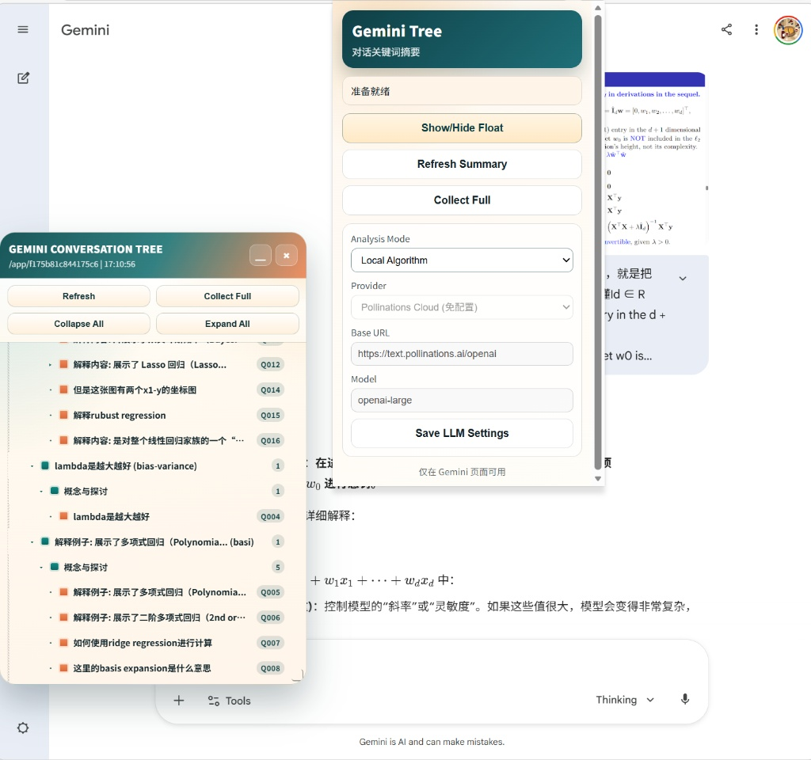

# Gemini Conversation Tree Overlay

一个面向 Edge 浏览器的 MV3 扩展：自动读取 Gemini 对话，将问答摘要为树状结构，并在页面上以可拖拽浮窗展示。



## 核心功能

- 自动捕获 Gemini 对话并组装为 Q/A 对。
- 本地摘要与聚类，按主题生成可折叠树结构。
- 支持浮窗拖拽、缩放、折叠、展开、手动刷新。
- 支持 Full Collect 以尽量拉取完整历史。
- 支持 LLM 分析模式（默认云端，可切换本地 Ollama）。

## 仓库结构

```
.
├─ manifest.json
├─ src/
│  ├─ background.js
│  ├─ content.js
│  ├─ content.css
│  ├─ popup.html
│  ├─ popup.css
│  └─ popup.js
├─ tests/
│  └─ regression.extract-topic.js
├─ CODE_OF_CONDUCT.md
├─ CONTRIBUTING.md
├─ SECURITY.md
├─ LICENSE
└─ README.md
```

## 快速开始（开发者模式）

1. 打开 edge://extensions
2. 开启 Developer mode
3. 点击 Load unpacked
4. 选择本仓库根目录
5. 打开 Gemini 会话页面验证浮窗

## 使用说明

- 点击扩展图标打开 popup。
- 常用动作：Show/Hide Float、Refresh Summary、Collect Full。
- 浮窗支持折叠展开。

## 本地开发与回归

- 主要逻辑位于 src/content.js。
- 函数级回归脚本位于 tests/regression.extract-topic.js。
- 运行回归示例：node tests/regression.extract-topic.js

## LLM 模式

- 默认 Provider：Pollinations Cloud（免配置）。
- 可切换 Local Ollama，按 popup 中 Base URL 与 Model 配置。

## 贡献

欢迎提交 Issue 和 PR。请先阅读 CONTRIBUTING.md。
社区协作行为规范见 CODE_OF_CONDUCT.md。

## 安全

如发现安全问题，请参考 SECURITY.md 进行负责任披露。

## 许可证

本项目基于 MIT License 开源，详见 LICENSE。

## 后续
- 支持拖拽与缩放
- 优化正则算法。提升本地算法的提取总结能力
- 优化LLM的api调用能力